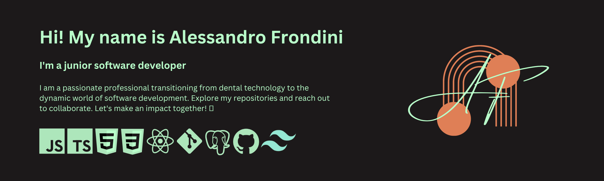

## About Me
Welcome to my GitHub! 🚀 I’m a career switcher on an exciting journey toward my dream job as a software developer. 
Currently pursuing a Master’s in Computer Science, I’m a dedicated full-stack developer with a passion for precision and attention to detail—skills I honed as a former dental technician. 
Join me as I build, collaborate, and approach every task with passion and dedication!

# Actively looking for a role as Software Developer!

  
  

<!--
**alessandro-001/alessandro-001** is a ✨ _special_ ✨ repository because its `README.md` (this file) appears on your GitHub profile.

Here are some ideas to get you started:

- 🔭 I’m currently working on ...
- 🌱 I’m currently learning ...
- 👯 I’m looking to collaborate on ...
- 🤔 I’m looking for help with ...
- 💬 Ask me about ...
- 📫 How to reach me: ...
- 😄 Pronouns: ...
- ⚡ Fun fact: ...
-->
