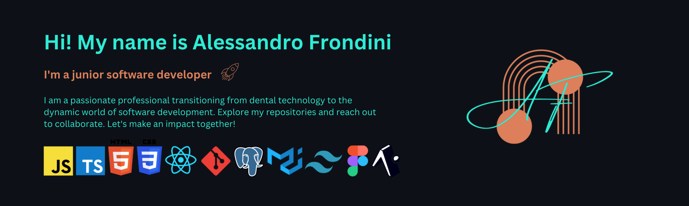

Welcome to my GitHub! 🚀 I'm an enthusiastic early-career software developer, always striving to improve and learn. My heart lies in the realm of front-end development, where my passion for precision and attention to detail, honed from my previous job as a dental technician, inspires me to create thoughtful user experiences. 
Join me on this exciting path as we collaborate and create quality work that delights users and exceeds expectations!

Stuff I'm currently involved with:
- ⚛ Front-end web projects and mobile applications, honing my skills with React/React-native ;
- 👾 Currently exploring C# ;
- 👯 I’m looking to collaborate on any projects that involves UI/UX ;

#

  
  

<!--
**alessandro-001/alessandro-001** is a ✨ _special_ ✨ repository because its `README.md` (this file) appears on your GitHub profile.

Here are some ideas to get you started:

- 🔭 I’m currently working on ...
- 🌱 I’m currently learning ...
- 👯 I’m looking to collaborate on ...
- 🤔 I’m looking for help with ...
- 💬 Ask me about ...
- 📫 How to reach me: ...
- 😄 Pronouns: ...
- ⚡ Fun fact: ...
-->
